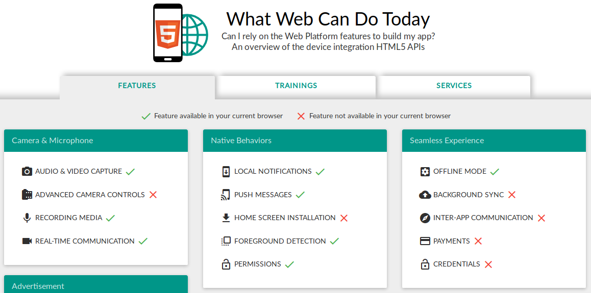

#HSLIDE

### The year after [#TheYearOfPWA](https://twitter.com/search?q=TheYearOfPWA)
#### An introduction to PWA developement with Angular and Angular Material

#HSLIDE
@title[Authors]

@snap[west span-50]
#### Igor Besel [@fa[gitlab]](https://gitlab.com/itothegore) [@fa[github]](https://github.com/igore)

@snapend

@snap[east span-50]
#### Kai Schröer [@fa[gitlab]](https://gitlab.com/splitt3r) [@fa[github]](https://github.com/splitt3r)

@snapend

#HSLIDE
@title[#TheYearOfPWA]

### #TheYearOfPWA

- 2018 was [proclaimed](https://twitter.com/webmaxru/status/947572865142009857) as the year of PWA by Maxim Salnikov

- A lot of new and helpful features / libraries / frameworks arised

- Apple joined the PWA party 🎉

#HSLIDE
@title[What are PWAs]

@quote[Progressive web apps use **modern web APIs** along with traditional **progressive enhancement** strategy to create cross-platform web applications. These apps **work everywhere** and provide several features that give them the **same user experience** advantages as **native apps**.]([Mozilla Developer Network](https://developer.mozilla.org/en-US/docs/Web/Progressive_web_apps))

#HSLIDE
@title[PWA Checklist]

### PWA Checklist

### If it looks like a native app, feels like a native app, and works offline, then it probably is a PWA 😀.

#VSLIDE

Some important PWA features:

- Responsive

- App like

- Installable

- Safe

- Offline first

#HSLIDE
@title[App Manifest]

### App Manifest

- Makes your app "installable"

- Allows you to define icons / a title / a description

- Orientation / Splashscreen / Browser window type

- Many more...

#HSLIDE
@title[Offline first]

### Offline first

- Connectivity independent

- Connectivity is only a matter of state

- Everything works offline just like it does online

#HSLIDE
@title[Service Worker]


Screenshot of [Is ServiceWorker ready?](https://jakearchibald.github.io/isserviceworkerready/) • By [Jake Archibald](https://github.com/jakearchibald)

#VSLIDE

- Requires HTTPS!

- Core feature of a PWA

- Used to cache the PWA on the client side (can do a whole lot more)

- Angular way: `ng add @angular/pwa`

#HSLIDE
@title[IndexedDB]

### IndexedDB

- Client side NoSQL database to store data from the server offline

- Can be accessed from inside the Service Worker (sync. storage like localStorage not)

- [Dexie.js](https://dexie.org) is a great way to get startet fast and easy (recommanded by [MDN](https://developer.mozilla.org/en-US/docs/Web/API/IndexedDB_API) to lower the barriers)

#HSLIDE
@title[Push Notifications]

### Push Notifications

- Get the user back with notifications

- Web Push protocol can be used by every push service

- Ready-to-use-packages are avaliable for different servers

#HSLIDE
@title[More cool APIs]


Created by [Adam Bar](https://adambar.pl/) • Licenced under [CC-BY-SA 4.0](https://creativecommons.org/licenses/by-sa/4.0/)

#HSLIDE
@title[PWAs in Angular]

### PWAs in Angular

#VSLIDE

```bash
npm -i -g @angular/cli@latest http-server
ng new pwa-demo
cd pwa-demo
ng add @angular/pwa
ng build --prod
cd dist/pwa-demo
http-server -c-1
```

@[1](Install global @angular/cli and http-server packages)
@[2-3](Generate a new Angular project)
@[4](Add @angular/pwa package with schematics)
@[5](Build in production mode !important)
@[6-7](Enter dist directory and start the http server)

#HSLIDE
@title[Tools / Resources]

### Tools / Resources

- [Lighthouse](https://developers.google.com/web/tools/lighthouse/)

- [App Manifest Generator](https://app-manifest.firebaseapp.com/)

- [Schematics](https://material.angular.io/guide/schematics)

- [PWA Toolkit by Ionic](https://ionicframework.com/pwa/toolkit)

#HSLIDE
@title[Future]

### Future

- PWAs at Desktop

- Publishable in Google Store

- Badging API

- Background Sync

- Fingerprint sensor

- Native SDK feature parity

#HSLIDE

## Live Code ✨

#HSLIDE

## Thank you ❤

#HSLIDE

## Questions?
